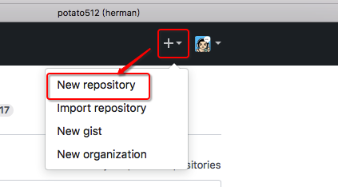
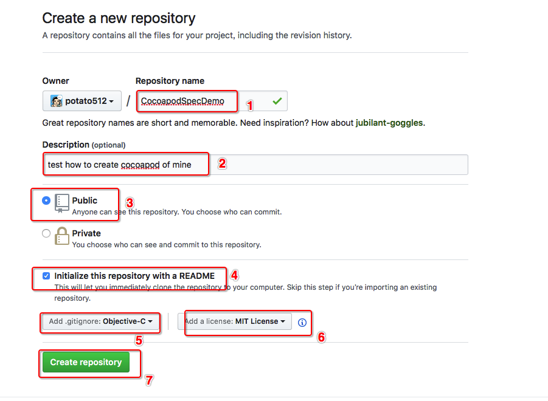
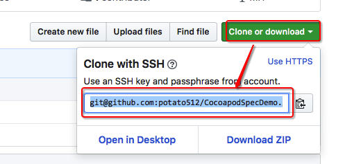
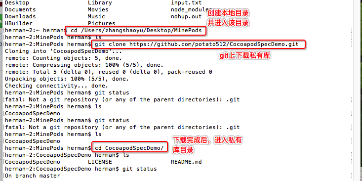
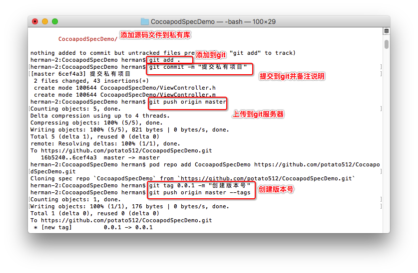
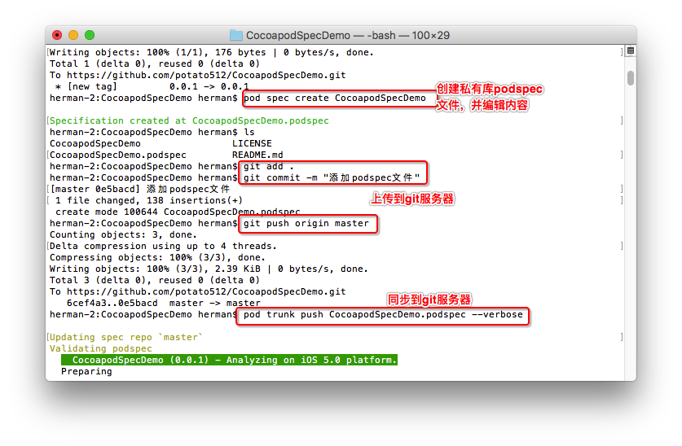

# CocoapodSpecDemo
github中创建自己的cocoapod私有库
依托github服务器，把自己写的功能类项目当作cocoapods私有库进行发布公开，便于他人利用，也便于自己使用和维护。

[github](https://github.com/)
[cocoapods](https://guides.cocoapods.org/syntax/podspec.html)

# 注意事项：
 * 1、必须包含的文件：LICENSE、prjectName.podspec
 * 2、相关文件必须在同一个目录层级：LICENSE、projectName.podspec、projectName项目文件
 * 3、相关文件名称必须一致，均使用projectName：私有库文件名称、私有库文件目录名称、.podspec文件名称

# 操作流程：
 * 1、（网站操作）github网站创建Repository，并获取路径。
  * （1）repository中必须设置LICENSE
  * （2）获取路径url，如 https://github.com/userName/projectName.git

 * 2、（终端操作）创建本地目录，便于操作
  * （1）进入本地目录：cd 目录名称
  * （2）使用命令clone项目到本地目录：
~~~ javascript
git clone https://github.com/userName/projectName.git
~~~
  * （3）添加到仓库：
~~~ javascript
pod repo add projectName https://github.com/userName/projectName.git
~~~ 
移除仓库：
~~~ javascript
pod repo remove projectName
~~~ 
更新仓库：
~~~ javascript
pod repo update projectName
~~~ 
 * 3、操作podspec文件
  * （1）创建podspec文件：
~~~ javascript
pod spec create projectName
~~~ 
  * （2）编辑podspec文件
  * （3）检验podspec文件：
本地校验文件：
~~~ javascript
pod lib lint
~~~ 
联网校验文件：
~~~ javascript
pod spec lint
~~~ 
选项：—verbose显示详细编译信息，—allow-warnings忽略警告，—sources编译时用到的源码地址，—use-libraries编译时加载依赖的其他静态库。如
~~~ javascript
pod spec lint —verbose
~~~ 
 * 4、修改文件提交
  * （1）提交到git缓存区：
~~~ javascript
git add .
~~~ 
  * （2）提交备注说明：
~~~ javascript
git commit -m “备注说明”
~~~ 
  * （3）提交到git服务器：
~~~ javascript
git push origin master
~~~ 
 * 5、设置tag
  * （1）设置版本号：
~~~ javascript
git tag x.x.x -m “version x.x.x”
~~~ 
  * （2）提交到git服务器：
~~~ javascript
git push origin master —tags
~~~ 
 * 6、发布私有库
  * （1）首次时需要注册：
~~~ javascript
pod trunk register emailName@xxx.com “userName” —description=“iMac” —verbose
~~~ 
  * （2）查看邮箱，并验证
  * （3）查看注册状态：
~~~ javascript
pod trunk me
~~~ 
  * （4）发布到git服务器：
~~~ javascript
pod trunk push projectName.podspec
~~~ 
  * （5）验证发布状态：
~~~ javascript
pod search projectName
~~~ 

# projectName.podspec文件内容编辑：
~~~ javascript
#
#  Be sure to run `pod spec lint projectName.podspec' to ensure this is a
#  valid spec and to remove all comments including this before submitting the spec.
#
#  To learn more about Podspec attributes see http://docs.cocoapods.org/specification.html
#  To see working Podspecs in the CocoaPods repo see https://github.com/CocoaPods/Specs/
#

Pod::Spec.new do |s|

# ―――  Spec Metadata  ―――――――――――――――――――――――――――――――――――――――――――――――――――――――――― #
#
#  These will help people to find your library, and whilst it
#  can feel like a chore to fill in it's definitely to your advantage. The
#  summary should be tweet-length, and the description more in depth.
#

# 项目名称
s.name         = “projectName”
# 版本
s.version      = “x.x.x”
# 描述
s.summary      = “项目说明.”

# This description is used to generate tags and improve search results.
#   * Think: What does it do? Why did you write it? What is the focus?
#   * Try to keep it short, snappy and to the point.
#   * Write the description between the DESC delimiters below.
#   * Finally, don't worry about the indent, CocoaPods strips it!
# 详细描述
s.description  = <<-DESC
详细描述项目
DESC
# 主页
s.homepage     = "https://github.com/userName/projectName”
# s.screenshots  = "www.example.com/screenshots_1.gif", "www.example.com/screenshots_2.gif"

# ―――  Spec License  ――――――――――――――――――――――――――――――――――――――――――――――――――――――――――― #
#
#  Licensing your code is important. See http://choosealicense.com for more info.
#  CocoaPods will detect a license file if there is a named LICENSE*
#  Popular ones are 'MIT', 'BSD' and 'Apache License, Version 2.0'.
#
# 证书
# s.license      = "MIT (example)"
s.license      = { :type => "MIT", :file => "FILE_LICENSE" }

# ――― Author Metadata  ――――――――――――――――――――――――――――――――――――――――――――――――――――――――― #
#
#  Specify the authors of the library, with email addresses. Email addresses
#  of the authors are extracted from the SCM log. E.g. $ git log. CocoaPods also
#  accepts just a name if you'd rather not provide an email address.
#
#  Specify a social_media_url where others can refer to, for example a twitter
#  profile URL.
#
# 作者
s.author             = { “userName” => “emailName@xxx.com" }
# Or just: s.author    = “userName”
# s.authors            = { “userName” => “emailName@xxx.com" }
# s.social_media_url   = "http://twitter.com/userName”

# ――― Platform Specifics ――――――――――――――――――――――――――――――――――――――――――――――――――――――― #
#
#  If this Pod runs only on iOS or OS X, then specify the platform and
#  the deployment target. You can optionally include the target after the platform.
#
# 支持版本
# s.platform     = :ios
s.platform     = :ios, "5.0"

#  When using multiple platforms
# s.ios.deployment_target = "5.0"
# s.osx.deployment_target = "10.7"
# s.watchos.deployment_target = "2.0"
# s.tvos.deployment_target = "9.0"

# ――― Source Location ―――――――――――――――――――――――――――――――――――――――――――――――――――――――――― #
#
#  Specify the location from where the source should be retrieved.
#  Supports git, hg, bzr, svn and HTTP.
#
# 版本地址
s.source       = { :git => "https://github.com/userName/projectName.git", :tag => "#{s.version}" }

# ――― Source Code ―――――――――――――――――――――――――――――――――――――――――――――――――――――――――――――― #
#
#  CocoaPods is smart about how it includes source code. For source files
#  giving a folder will include any swift, h, m, mm, c & cpp files.
#  For header files it will include any header in the folder.
#  Not including the public_header_files will make all headers public.
#
# 源文件地址（相对于.podspec文件的路径）——重要
s.source_files  = “projectName”, "projectName/**/*.{h,m}”
# s.exclude_files = "Classes/Exclude"
# 头文件地址
# s.public_header_files = "Classes/**/*.h"

# ――― Resources ―――――――――――――――――――――――――――――――――――――――――――――――――――――――――――――――― #
#
#  A list of resources included with the Pod. These are copied into the
#  target bundle with a build phase script. Anything else will be cleaned.
#  You can preserve files from being cleaned, please don't preserve
#  non-essential files like tests, examples and documentation.
#

# s.resource  = "icon.png"
# s.resources = "Resources/*.png"

# s.preserve_paths = "FilesToSave", "MoreFilesToSave"

# ――― Project Linking ―――――――――――――――――――――――――――――――――――――――――――――――――――――――――― #
#
#  Link your library with frameworks, or libraries. Libraries do not include
#  the lib prefix of their name.
#

# 支持的framework
# s.framework  = "SomeFramework"
# s.frameworks = "SomeFramework", "AnotherFramework"

# 支持的库
# s.library   = "iconv"
# s.libraries = "iconv", "xml2"

# ――― Project Settings ――――――――――――――――――――――――――――――――――――――――――――――――――――――――― #
#
#  If your library depends on compiler flags you can set them in the xcconfig hash
#  where they will only apply to your library. If you depend on other Podspecs
#  you can include multiple dependencies to ensure it works.
# 是否支持ARC
s.requires_arc = true

# 支持的第三方库
# s.xcconfig = { "HEADER_SEARCH_PATHS" => "$(SDKROOT)/usr/include/libxml2" }
# s.dependency "JSONKit", "~> 1.4"

end
~~~

# 导入使用示例：
~~~ javascript
platform :ios, '7.0'
target ‘项目名称' do
pod ‘projectName’, '~>x.x.x’
end
~~~

# 异常处理：
### file patterns: The `source_files` pattern did not match any file.
解决：检查你.podspec文件中s.source_files路径有没有填错。
源文件所在目录名称与xx.podspec文件保持同名，且在同一个层级。

### file patterns: The `public_header_files` pattern did not match any file.
解决：检查你.podspec文件中public_header_files路径有没有填错
源文件所在目录名称与xx.podspec文件保持同名，且在同一个层级。

### [!] You need to register a session first.
解决：第一次使用时需要注册
（1）注册命令：pod trunk register xxx@xxx.com 'yourname' --description='iMac' --verbose
（2）查看邮箱验证
（3）查看命令：pod trunk me

### [!] The validator for Swift projects uses Swift 3.0 by default, if you are using a different version of swift you can use a `.swift-version` file to set the version for your Pod. For example to use Swift 2.3, run: 
`echo "2.3" > .swift-version`.
解决：echo "3.0" > .swift-version

### [!] Unable to find a pod with name, author, summary, or description matching `CocoapodSpecDemo`
解决：
（1）删除缓存：rm ~/Library/Caches/CocoaPods/search_index.json
（2）再重输入搜索：pod search xxxx

### 初次创建私有库时，如果没有创建LICENSE文件，则会造成执行"pod trunk push xxxx"命令时出错。
解决：在github的项目中，后续创建LICENSE文件。创建方法：进入github项目-选择<>code-Create new file-Name your file（LICENSE）-choose a license（MIT license）-Commit new file

